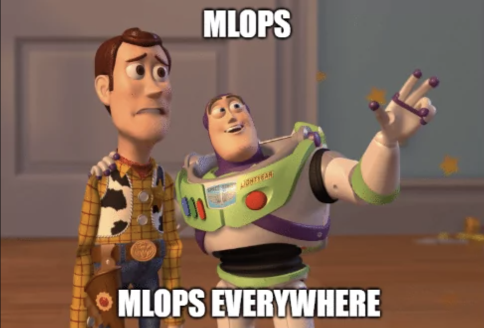
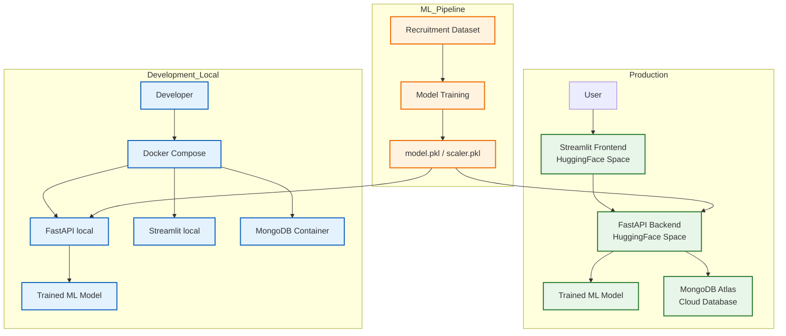

# MLOps Hiring - Full Stack ML System

A production-ready end-to-end MLOps system for recruitment probability prediction.

**Try the Live Demo 👇**

 
 

 
"MLOps, MLOps everywhere"

---

## Full Architecture (Development & Production)

---

## System Overview

This project demonstrates a full MLOps pipeline deployed in production:

- Model training pipeline
- Containerized backend API
- Frontend application
- Cloud database logging
- Secret management
- CI/CD automation
- Multi-environment deployment
- Health monitoring endpoint

### Production Flow

User → Streamlit (HF) → FastAPI (HF) → MongoDB Atlas

### Local Development

Docker Compose for full-stack testing.

---

## Repositories

### Core (Local Full-Stack)

https://github.com/rsquaredata/mlops-hiring-predictor

Includes:

- Model training pipeline
- Dockerized microservices
- MongoDB container
- Full local orchestration

### Backend (Production API - HuggingFace Space)

https://github.com/rsquaredata/mlops-hiring-backend-hf

Includes:

- FastAPI
- Cloud MongoDB Atlas
- Model inference endpoint
- Healthcheck endpoint
- CORS configuration
- Production Dockerfile

### Frontend (Production UI - HuggingFace Space)

https://github.com/rsquaredata/mlops-hiring-frontend-hf

Includes:

- Streamlit interface
- Remote API integration
- Production deployment

---

## Tech Stack

- Python 3.12
- Scikit-learn
- FastAPI
- Streamlit
- MongoDB Atlas
- Docker
- Docker Compose
- GitHub Actions
- HuggingFace Spaces

---

## Features

- End-to-end ML pipeline
- API-based inference
- Production deployment
- Cloud database logging
- Health monitoring endpoint
- Containerized microservices
- Full CI/CD workflow
